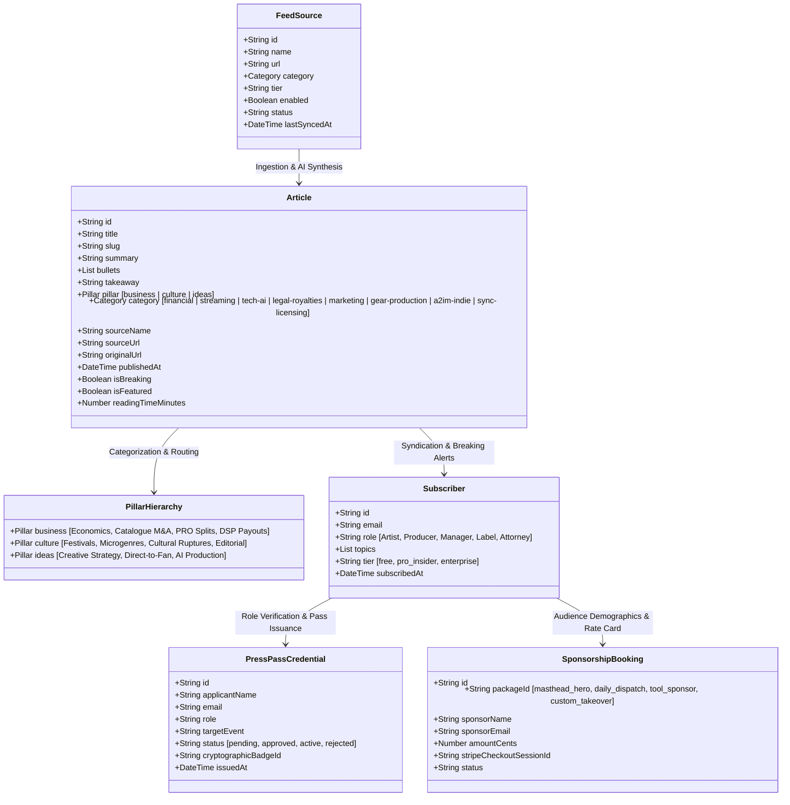
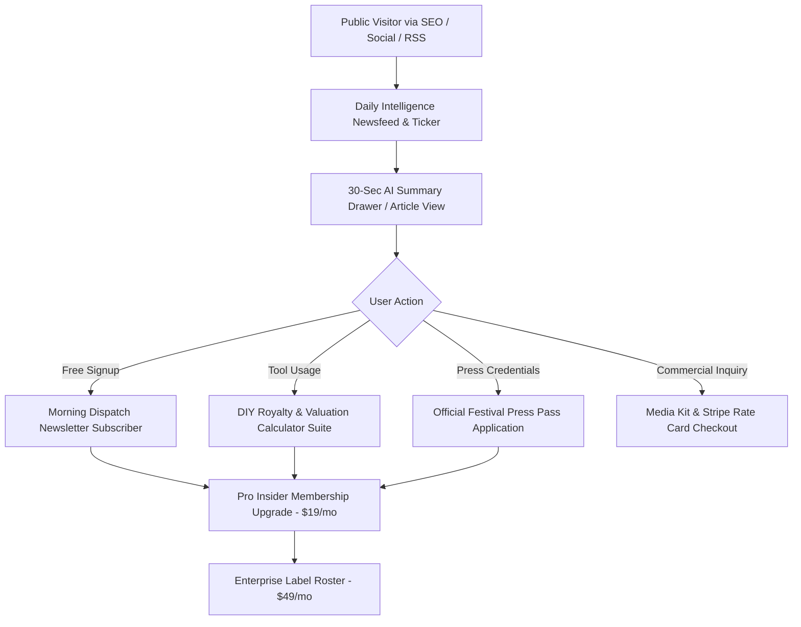

# 04. Information Architecture & Content Taxonomy — ArtistDailyNews.com

Artist Daily News (ADN) is engineered as an institutional-grade music industry intelligence hub, utility toolkit, and credentialing platform powered by the **Artispreneur** ecosystem.

---

## 1. Core Domain Object Model



---

## 2. Structural Content Hierarchy & Navigation Tiers

```
Level 0: Global Navigation Header (Unified across all pages via RootLayout)
 ├── Top Ticker & Utility Bar
 │    ├── Live Breaking Headlines Marquee
 │    ├── Edition Date & City Marker (e.g. Chicago / Global Edition)
 │    ├── DSP Streaming Rates Ticker (Spotify $0.0038 / Apple $0.0078 / Tidal $0.0125)
 │    └── Partner Perks Link (/network)
 ├── Masthead Brand Lockup
 │    ├── ADN Obsidian & Crimson Brand Badge
 │    └── Artispreneur Ecosystem Official Laurel & Wordmark
 ├── Core Pillar Tabs (Editorial Foundation)
 │    ├── 📊 BUSINESS (Royalties, Wall Street NPS Multiples, Publishing)
 │    ├── 🎧 CULTURE (Festivals, Micro-genres, A&R Momentum)
 │    └── 💡 IDEAS (Direct-to-Fan, Release Sequences, Masterclasses)
 └── Channel Desks & Utilities
      ├── News Channels (/topics/financial, /topics/streaming, /topics/tech-ai, etc.)
      ├── Podcasts & Masterclasses (/podcasts)
      ├── Morning Dispatch Archive (/newsletters)
      ├── Calculator & Blueprint Suite (/tools)
      ├── VIP Press Pass Accreditation (/press-pass)
      ├── Artispreneur Network & Partner Discounts (/network)
      └── Media Kit & Rate Card (/advertise)
```

---

## 3. Pillar & Category Mapping

| Pillar | Sub-Desks / Slugs | Primary Audience JTBD |
| :--- | :--- | :--- |
| **Business** | `/topics/financial`, `/topics/legal-royalties`, `/topics/sync-licensing` | Value catalogue IP, collect global mechanicals, understand DSP pool changes |
| **Culture** | `/topics/streaming`, `/topics/a2im-indie`, `/news` | Track festival lineups, viral playlist velocity, independent label deals |
| **Ideas** | `/topics/tech-ai`, `/topics/marketing`, `/topics/gear-production` | Master AI mastering tools, 21-day pitch sequence, direct-to-fan monetization |

---

## 4. Monetization & Commercial Funnel


