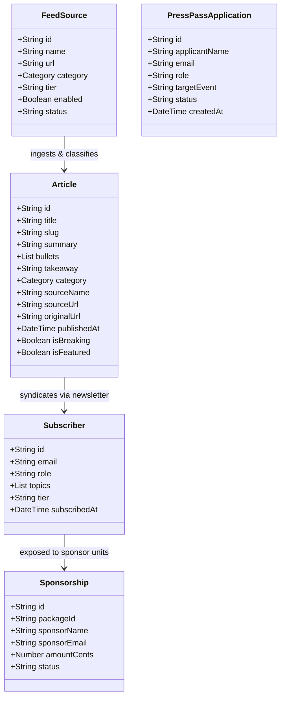

# 04. Information Architecture — ArtistDailyNews.com

## 1. Domain Object Model

## 2. Navigation Taxonomy

- **Global Navigation (Header)**:
  - Today's Live Feed (`/`)
  - Royalties & Catalogues (`/topics/financial`)
  - Streaming & Playlists (`/topics/streaming`)
  - AI & Tech (`/topics/tech-ai`)
  - Podcasts & Interviews (`/podcasts`)
  - Royalty Calculators (`/tools`)
  - Apply for Press Pass (`/press-pass`)
  - Advertise / Media Kit (`/advertise`)
  - Newsroom Agent Studio (`/admin/newsdesk`)
- **Utility & Legal Navigation (Footer)**:
  - Google Ads.txt (`/ads.txt`)
  - Master RSS XML Feed (`/api/news/feed?format=rss`)
  - Newsletter Dispatch Archive (`/newsletters`)
