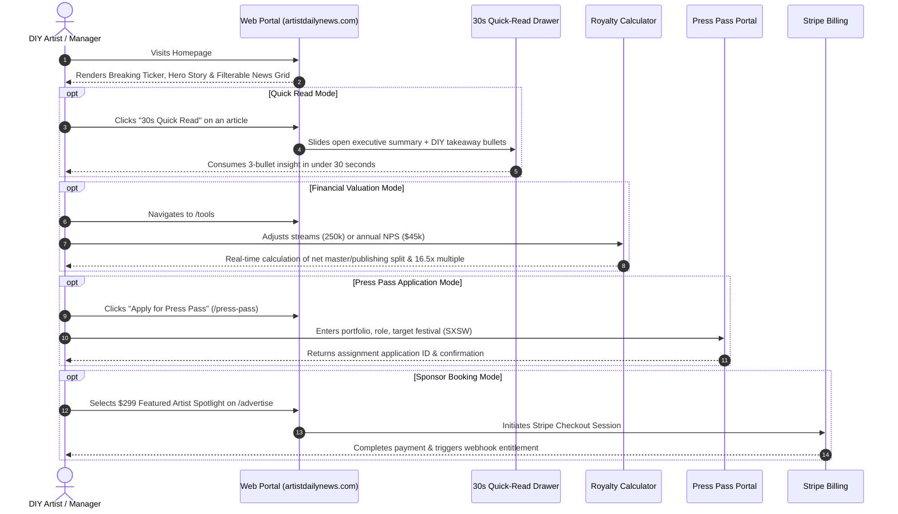

# 06. User Flows — ArtistDailyNews.com

```mermaid
sequenceDiagram
    autonumber
    actor Reader as DIY Artist / Manager
    participant Web as Web Portal (artistdailynews.com)
    participant Drawer as 30s Quick-Read Drawer
    participant Tools as Royalty Calculator
    participant Press as Press Pass Portal
    participant Stripe as Stripe Billing

    Reader->>Web: Visits Homepage
    Web-->>Reader: Renders Breaking Ticker, Hero Story & Filterable News Grid
    
    opt Quick Read Mode
        Reader->>Web: Clicks "30s Quick Read" on an article
        Web->>Drawer: Slides open executive summary + DIY takeaway bullets
        Drawer-->>Reader: Consumes 3-bullet insight in under 30 seconds
    end

    opt Financial Valuation Mode
        Reader->>Web: Navigates to /tools
        Reader->>Tools: Adjusts streams (250k) or annual NPS ($45k)
        Tools-->>Reader: Real-time calculation of net master/publishing split & 16.5x multiple
    end

    opt Press Pass Application Mode
        Reader->>Web: Clicks "Apply for Press Pass" (/press-pass)
        Reader->>Press: Enters portfolio, role, target festival (SXSW)
        Press-->>Reader: Returns assignment application ID & confirmation
    end

    opt Sponsor Booking Mode
        Reader->>Web: Selects $299 Featured Artist Spotlight on /advertise
        Web->>Stripe: Initiates Stripe Checkout Session
        Stripe-->>Reader: Completes payment & triggers webhook entitlement
    end
```
