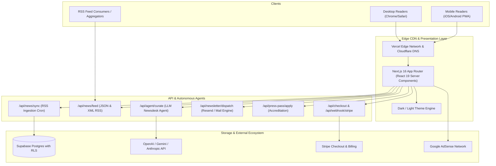

# 10. System Architecture — ArtistDailyNews.com

## AWS Well-Architected Gate Assessment
- **Operational Excellence**: Zero-touch hourly automated ingestion pipeline with comprehensive logging in `/admin/newsdesk`.
- **Security**: Strict Postgres RLS policies, zero client-side secret exposure, encrypted webhook signatures.
- **Reliability**: Dual-fallback architecture: if external LLM or RSS endpoints time out, heuristic parsers and cached articles prevent downtime.
- **Performance Efficiency**: Next.js App Router edge caching with sub-second FCP.
- **Cost Optimization**: Serverless edge compute with on-demand AI inference.
- **Sustainability**: Minimal CPU overhead with XML stream parsing.
