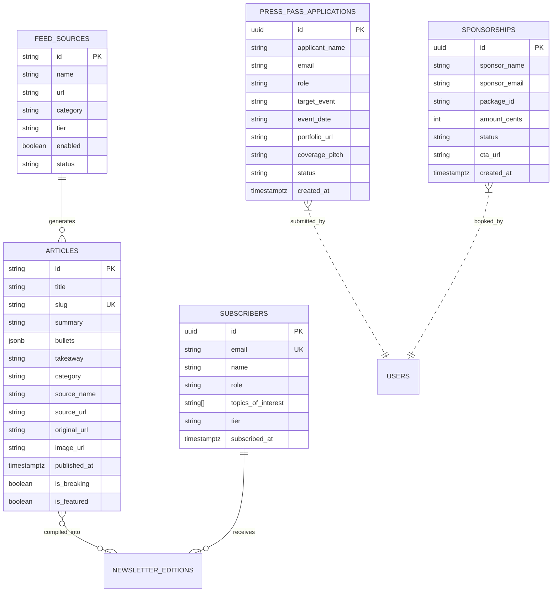

# 12. Data Model & Entity Relationships — ArtistDailyNews.com

```mermaid
erDiagram
    FEED_SOURCES ||--o{ ARTICLES : generates
    ARTICLES }o--o{ NEWSLETTER_EDITIONS : compiled_into
    SUBSCRIBERS ||--o{ NEWSLETTER_EDITIONS : receives
    PRESS_PASS_APPLICATIONS }|..|| USERS : submitted_by
    SPONSORSHIPS }|..|| USERS : booked_by

    FEED_SOURCES {
        string id PK
        string name
        string url
        string category
        string tier
        boolean enabled
        string status
    }

    ARTICLES {
        string id PK
        string title
        string slug UK
        string summary
        jsonb bullets
        string takeaway
        string category
        string source_name
        string source_url
        string original_url
        string image_url
        timestamptz published_at
        boolean is_breaking
        boolean is_featured
    }

    SUBSCRIBERS {
        uuid id PK
        string email UK
        string name
        string role
        string[] topics_of_interest
        string tier
        timestamptz subscribed_at
    }

    PRESS_PASS_APPLICATIONS {
        uuid id PK
        string applicant_name
        string email
        string role
        string target_event
        string event_date
        string portfolio_url
        string coverage_pitch
        string status
        timestamptz created_at
    }

    SPONSORSHIPS {
        uuid id PK
        string sponsor_name
        string sponsor_email
        string package_id
        int amount_cents
        string status
        string cta_url
        timestamptz created_at
    }
```
